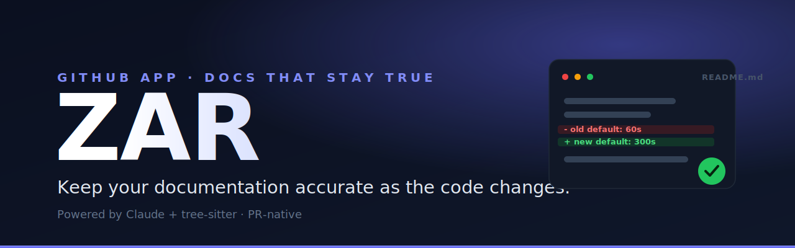

<p align="center">
  
</p>

<h1 align="center">ZAR</h1>

<p align="center">
  <em>The AI agent that lives in your GitHub repo and keeps your documentation from going stale.</em>
</p>

<p align="center">
  <a href="https://app.zarlabs.tech">
    
  </a>
  <a href="getting-started/quickstart.md">
    
  </a>
</p>

<p align="center">
  
  
  
  <a href="LICENSE"></a>
</p>

<p align="center"><sub>
  <a href="#what-is-zar">What is ZAR</a> ·
  <a href="#how-it-works">How it works</a> ·
  <a href="#quickstart">Quickstart</a> ·
  <a href="#documentation">Docs</a> ·
  <a href="#commands">Commands</a> ·
  <a href="#how-zar-compares">Compare</a> ·
  <a href="#plans">Plans</a> ·
  <a href="#faq">FAQ</a> ·
  <a href="#license">License</a>
</sub></p>

---

> **This repository is the official documentation for ZAR.**
> Browse it here on GitHub, or read the rendered site once it's published with [Mintlify](https://mintlify.com).
> New here? Start with the **[Quickstart](getting-started/quickstart.md)**.

## What is ZAR

Pull requests change APIs, flags, and flows. The `README` and `docs/` almost always lag behind, and reviewers are left mentally tracking *"we should update the docs"* until it's forgotten.

**ZAR is a GitHub App that closes that gap.** It watches your repository, reads code diffs the way a reviewer would, and proposes **minimal, surgical edits** to your Markdown docs — as a pull request you review and merge, never a silent force-push.

- **Reads diffs with Claude + tree-sitter.** It extracts the changed functions, classes, and signatures, then asks Claude for the smallest doc edit that makes the docs true again.
- **PR-native.** Suggestions arrive as PR comments and a dedicated docs PR, right where review already happens.
- **Conservative by default.** ZAR never invents facts, never commits without explicit opt-in, and ships nothing in dry-run mode.
- **Optional CI gate.** Block a merge when the docs look stale, the same way you'd block on a failing test.
- **Speaks plain English.** Drive it from a PR comment: `@docagent style "…"`, `@docagent enable ci-gate`, `@docagent update docs now`.

ZAR is **not** a hosted docs website. It meets your team inside GitHub and keeps the docs you already have honest.

## How it works

```
GitHub event ──▶ verify signature ──▶ analyze diff (tree-sitter)
   (push / PR)                              │
                                            ▼
                              is the change doc-worthy?  ──no──▶ set "zar/docs" status ✓
                                            │ yes
                                            ▼
                          Claude proposes minimal Markdown patches
                                            │
                                            ▼
                  PR comment  +  docs PR  (or commit, only if you opted in)
```

1. GitHub sends a `push` or `pull_request` webhook; ZAR verifies the HMAC signature before doing anything.
2. tree-sitter parses the changed code and extracts public symbols (functions, classes, methods) and signature changes.
3. ZAR decides whether the change is *significant* (new public API, deletions/renames, meaningful diff size) — trivial, test-only, and config-only changes are skipped.
4. Claude is asked for **minimal unified-diff patches** to existing Markdown, grounded strictly in the diff.
5. ZAR opens (or updates) a single docs PR, comments on the source PR, and posts a `zar/docs` commit status. It commits directly only when you've explicitly enabled auto-commit.

Full walkthrough: **[How ZAR works](concepts/how-it-works.md)** and **[Safety & guarantees](concepts/safety-and-guarantees.md)**.

## Quickstart

The fastest path is the hosted app — no infrastructure required.

1. Go to **[app.zarlabs.tech](https://app.zarlabs.tech)** and sign in with GitHub.
2. Click **Connect a repo** and install the GitHub App on a single repository (`Only select repositories`).
3. Open a pull request that changes real behavior — a new config flag, a new endpoint, a renamed field.
4. ZAR reviews the diff and either comments with proposed doc edits or marks the docs in sync.

Step-by-step with screenshots and verification: **[Quickstart](getting-started/quickstart.md)**.

Prefer to run your own instance? See **[Self-hosting](self-hosting/overview.md)**.

## Documentation

| Section | Page |
|--|--|
| **Getting started** | [Introduction](getting-started/introduction.md) · [Quickstart](getting-started/quickstart.md) · [Installation](getting-started/installation.md) |
| **Concepts** | [How ZAR works](concepts/how-it-works.md) · [Safety & guarantees](concepts/safety-and-guarantees.md) |
| **Configuration** | [Overview & precedence](configuration/overview.md) · [`.zar.yml` reference](configuration/zar-yml.md) · [Trigger modes](configuration/trigger-modes.md) · [Style guide](configuration/style-guide.md) |
| **Features** | [PR feedback](features/pr-feedback.md) · [CI gate](features/ci-gate.md) · [Auto-commit](features/auto-commit.md) · [Commands](features/commands.md) · [Dashboard](features/dashboard.md) · [Cross-repo docs](features/cross-repo-docs.md) · [MDX & multilingual](features/mdx-and-multilingual.md) · [Notifications](features/notifications.md) |
| **Reference** | [All settings](reference/settings.md) · [Commands](reference/commands.md) · [Environment variables](reference/environment-variables.md) · [Permissions & events](reference/permissions-and-events.md) |
| **Self-hosting** | [Overview](self-hosting/overview.md) · [Railway](self-hosting/railway.md) · [Docker](self-hosting/docker.md) |
| **More** | [Plans](plans.md) · [Troubleshooting](troubleshooting.md) · [FAQ](faq.md) · [Security](security.md) · [Privacy](privacy.md) · [Terms](terms.md) · [Changelog](changelog.md) |

## Commands

In any pull request or issue comment (the author needs **write** access to the repo):

```text
@docagent help
@docagent status
@docagent style "Write like Stripe: short sentences, tables for params, a code example per endpoint"
@docagent enable ci-gate
@docagent disable ci-gate
@docagent enable auto-commit
@docagent update docs now
```

`/docagent`, `@zar`, and `/zar` are accepted as aliases. Full reference: **[Commands](reference/commands.md)**.

## How ZAR compares

| | **ZAR** | **Mintlify** | **Swimm** | **Generic LLM bots** |
|--|--|--|--|--|
| Tied to GitHub PRs | Native GitHub App | Docs platform | Playlists + IDE | Varies |
| Uses your existing repo layout | Yes (`README`, `docs/**`) | Hosted site | Repo-linked | Ad hoc |
| Diff-grounded suggestions | Yes (patches + AST hints) | N/A (authoring) | Code-coupled docs | Often generic |
| CI / merge gate | Optional labels + checks | N/A | Collaboration | Rare |
| Self-host option | Yes | Cloud | Cloud + tooling | N/A |

ZAR and a docs *platform* like Mintlify are complementary: ZAR keeps the source Markdown accurate; Mintlify publishes it as a site.

## Plans

ZAR is a subscription product. A paid plan (or complimentary access) is required before ZAR will open documentation PRs; analysis and commit statuses can still run while you evaluate.

| Plan | Repos | Monthly commits | CI gate | Cross-repo docs | MCP server |
|--|--|--|--|--|--|
| **Pro** | 10 | 500 | — | — | — |
| **Team** | Unlimited | Unlimited | ✓ | ✓ | ✓ |
| **Enterprise** | Unlimited | Unlimited | ✓ | ✓ | ✓ |

Current pricing is shown on the **[dashboard](https://app.zarlabs.tech)** and the GitHub Marketplace listing. See **[Plans](plans.md)** for the full breakdown.

## Security & privacy

- ZAR verifies every webhook with an HMAC-SHA256 signature and processes nothing that fails the check.
- Bounded code excerpts are sent to Anthropic's Claude to generate suggestions; nothing is committed unless you opt in.
- Report vulnerabilities per **[Security](security.md)**. Data handling is described in **[Privacy](privacy.md)**.

## FAQ

**Does ZAR edit my docs without asking?**
No. By default it only comments and opens a reviewable PR. Direct commits require you to turn on auto-commit *and* the operator to set `DOCAGENT_WRITE_COMMITS`. See [Auto-commit](features/auto-commit.md).

**Will it spam me on every commit?**
No. The default trigger mode is `on_significant_change`, and trivial, test-only, and config-only diffs are skipped. Tune it in [Trigger modes](configuration/trigger-modes.md).

**What languages does it understand?**
ZAR recognizes Python, TypeScript/TSX, JavaScript/JSX, Go, Java, Kotlin, and Rust as code; symbol-level extraction (functions, classes, methods) is deepest for Python and TypeScript/TSX. Docs themselves can be `.md`, `.mdx`, or `.markdown`, including Nextra-style multilingual sites. See [MDX & multilingual](features/mdx-and-multilingual.md).

**Can I run it on my own infrastructure?**
Yes. ZAR is a FastAPI app you can deploy with Docker, Railway, or any host that gives you an HTTPS webhook URL. See [Self-hosting](self-hosting/overview.md).

**How is this different from a docs platform?**
A platform publishes a site. ZAR keeps the underlying Markdown *correct* as code changes. Use both.

## Contributing

Found something wrong or missing in these docs? Open an issue or PR. See **[CONTRIBUTING.md](CONTRIBUTING.md)**.

## License

[Apache-2.0](LICENSE).
